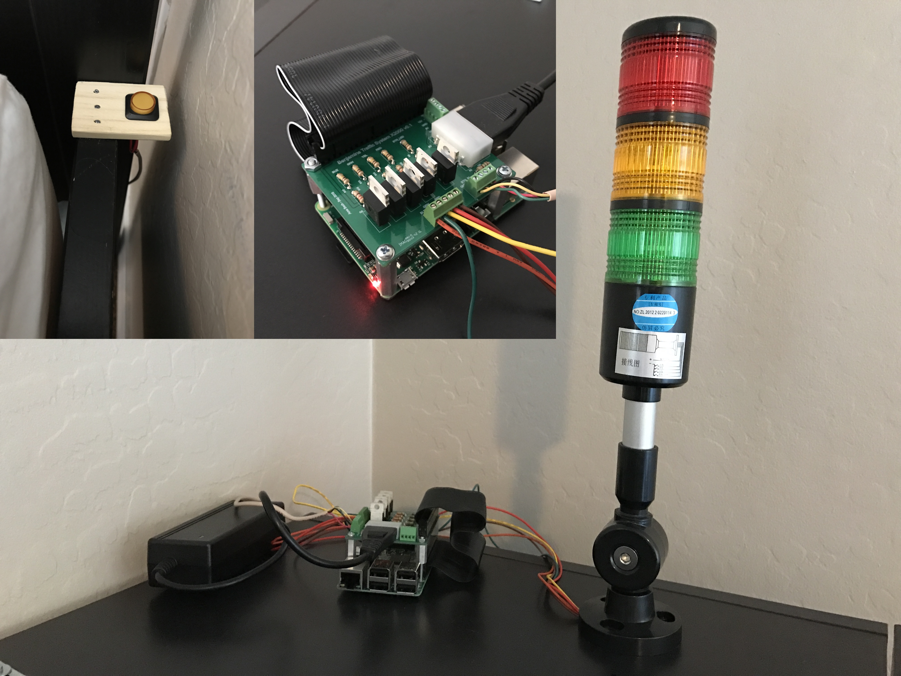
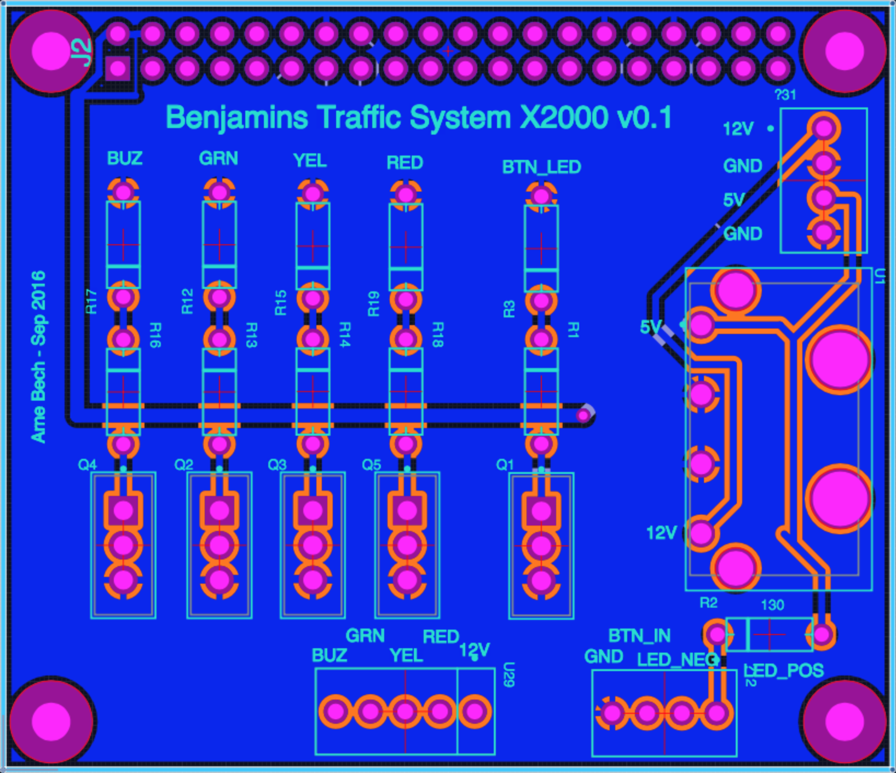
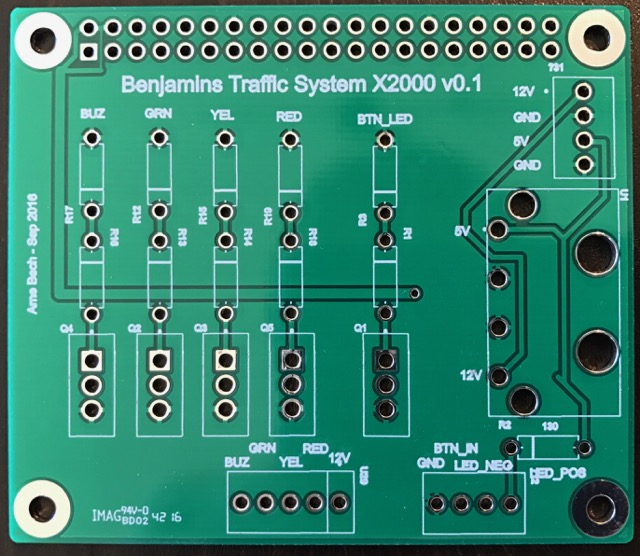
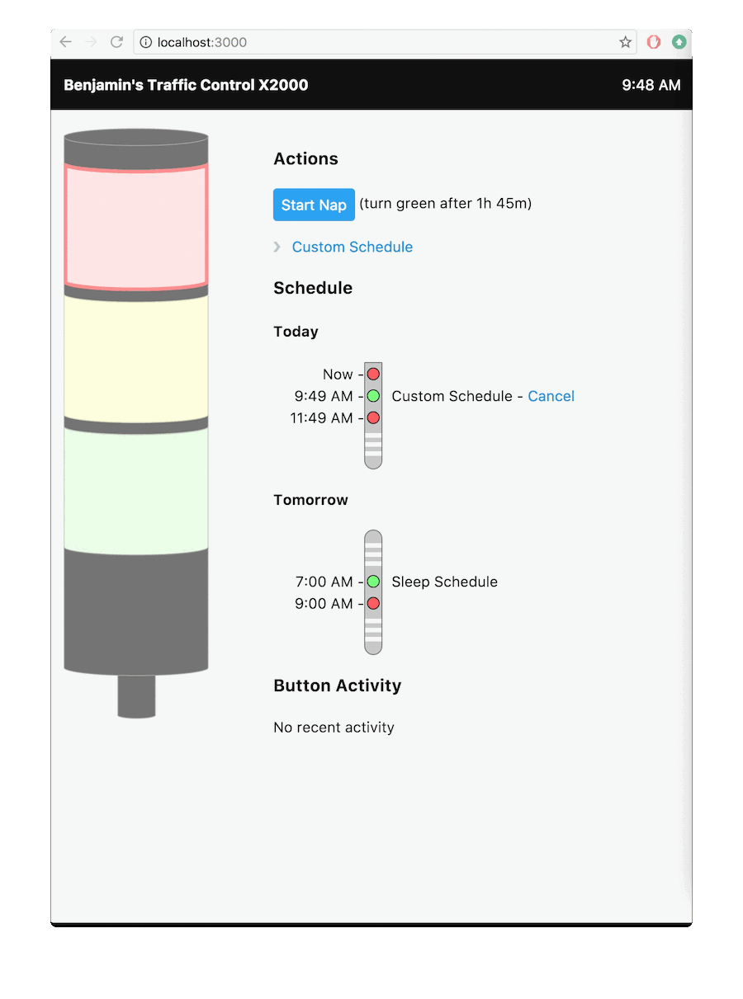
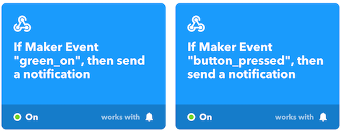

# Benjamin's Traffic System X2000

A small, fun project to (hopefully) keep my toddler in bed.




## Overview

### What is it?

A tower light with different colors telling my toddler if it's time to get out of bed or not. It's activated by pressing a button mounted on the side of the bed. Red means stay in bed and green means he can get out if he wants to (think of it as a binary clock). It has a web interface for control and can send notifications to the parents.


### Motivation

- Wanted to build something physical (not just software)
- Have a PCB manufactured
- Hopefully improve my toddler’s sleeping habits

> **Note**: If you only care about the last point, there are toddler alarms clocks available, such as as [this one from Amazon](http://amzn.to/2xNpdFX).


## Hardware

Raspberry Pi 3 with a auxiliary custom made PCB board for controlling the lights and button.

### Raspberry Pi 3

I wanted the unit to be self-contained (e.g. run it's own Nodejs server) and come with built-in WiFi. The Raspberry Pi 3 does that and has some room to grow. I got a [kit from Amazon](http://amzn.to/2eGJXps) with a few extras.


### Light and Button

Found a nice [tower light from Adafruit](https://www.adafruit.com/products/2993). It's driven by 12V.

[Button with built in LED](https://www.adafruit.com/products/1441) from Adafruit as well. I mounted the button on a small piece of wood (part of a free paint mixing stick from Lowes) and mounted it to the side of the bed. 

> **Note:** While the built-in button LED is wired up, it is not yet used. 


### Power Supply
Since I needed both 5V and 12V, I picked up a [dual power supply](https://www.sparkfun.com/products/11296) from Sparkfun. 

> **Warning**: This power supply seems poorly suited as it does not provide a good 5V voltage when there is no load on the 12V side. That said, it does work so far. 

> **Note**: This design feeds power to the Pi directly, which means that it bypasses the input voltage protection on the Pi. 


### Auxiliary PCB

The lights are 12V and the current is above what the Raspberry Pi can safely drive, so an intermediate interface is needed. 

The design is simple. The lights are controlled my MOSFETs (perhaps overkill). While these MOSFETs can be driven while directly connected to the Raspberry Pi, I added both a pull-down resistor (to keep the MOSFETs in the off state by default) as well as an inline resistor to protect the Raspberry Pi (though this seems unnecessary).

The button input is passed straight through to the Raspberry Pi, which should have its own pull-up resistor. 

> **Note**: The Raspberry Pi pull-up resistor is pretty weak, so I saw interference from the ceiling fan (when turning it on and off). This was fixed in the software by ignoring very short pulses. 

I designed the PCB so that the mounting holes align with the Raspberry Pi.

#### PCB Design

I tried Upverter for this project, which worked pretty well. They have an in-browser app that can be used for free. PCB files are included in the [pcb directory](pcb).

For simplicity when soldering, I used through-hole components. 

Design is also [available on Upverter](https://upverter.com/arnebech/b84798a7fe0ca9e5/Benjamins-Light-System/).




#### PCB Manufacturing

Once finished, I exported it and sent it to [pcb4u.com (Accutrace)](https://pcb4u.com) as they had a very good deal. However, building and shipping did take a long time, so I might try [OSH Park](https://oshpark.com) if I create more PCBs in the future. 




## Software



Building the physical system was more interesting than the software, so I used NodeJS with ExpressJS (and the [express generator](http://expressjs.com/en/starter/generator.html)) on the backend, and Knockout (which is used at my workplace, so low startup cost) on the front-end.

Essentially, I wanted a visual live representation of the light, the ability to start a nap timer, the option to add a custom schedule, and the ability to monitor button presses. 


### Notifications
[IFTTT](https://ifttt.com/) is used to deliver real-time notifications when the light turns green and when the button has been pressed using the IFTTT Maker recipe. 




### Run

```sh
npm install
npm start
```
Override defaults in a new config file `config/config.machine.ini` as needed.

### Development on regular machine
Unless, `gpio:enabled` is set to `true`, it will load a mock version of the gpio controller for the raspberry. To simulate a button click, type `toggle` in stdin. Light status can be observed in the web interface, as well as being logged in the stdout. 

## Update
### 10 month update
Does it work? I am sure it depends on the family, but it has been a helpful tool for ours. 

We started using the yellow light, to indicate "rest" time in the room where restful activities such as reading books and puzzles are encouraged in addition to sleeping.

As my toddler gets older he should learn to read the clock making BTS obsolete, and then at some point the younger sibling will perhaps inherit it :)


